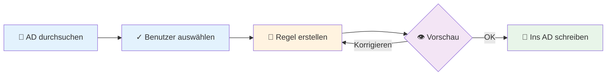

<div align="center">

# 🔄 AD Bulk Changes

### Massenänderungen im Active Directory – einfach, sicher, mit Vorschau

[](https://dotnet.microsoft.com/)
[](https://learn.microsoft.com/windows/apps/winui/)
[](LICENSE)

[📥 Download](Deploy/AD-BulkChanges.exe) • [📖 Docs](docs/) • [🔧 Build](build/BUILD.md)

</div>

---

## 💡 Was macht das Tool?

**AD Bulk Changes** ermöglicht dir, hunderte Benutzer im Active Directory gleichzeitig zu bearbeiten – mit smarten Filtern und Live-Vorschau.



### 🎯 Kernfunktionen

<table>
<tr>
<td width="50%">

**🔍 Smart Filtering**
- Benutzer nach Bedingungen filtern
- UND/ODER-Verknüpfungen
- Mehrere Bedingungen kombinierbar

**🎨 Intelligente Regeln**
- WENN → DANN Logik
- Multi-Field Updates
- Wert-Transformationen

</td>
<td width="50%">

**👁️ Sichere Vorschau**
- Änderungen vor dem Speichern prüfen
- Lokale Simulation
- Rückgängig-Option

**📦 Export & Templates**
- CSV Import/Export
- Regeln als Templates speichern
- Wiederverwendbare Konfigurationen

</td>
</tr>
</table>

---

## 🚀 Quick Start

### Anwendung starten

```powershell
.\Deploy\AD-BulkChanges.exe
```

### Typischer Workflow

1. **🌳 OU auswählen** → Klicke auf einen Ordner im AD-Tree
2. **✓ Benutzer laden** → Klick auf "Benutzer laden" (oder Checkbox für Unterordner)
3. **📝 Regel erstellen**:
   - **MUSS**: Bedingungen setzen (z.B. Abteilung = Verkauf)
   - **DANN**: Änderungen definieren (z.B. Position → Vertriebsleiter)
4. **👁️ Vorschau prüfen** → Kontrolle der Änderungen in der Tabelle
5. **💾 Speichern** → Änderungen ins AD schreiben

---

## 📸 Beispiel: "Alle Verkaufsleiter umbenennen"

```
MUSS:  Abteilung = "Verkauf" UND Position = "Leitung"
DANN:  Position → "Vertriebsleiter"
```

**Ergebnis:** Alle Benutzer mit `Abteilung=Verkauf` UND `Position=Leitung` bekommen automatisch `Position=Vertriebsleiter`.

---

## 🛠️ Tech Stack

| Technologie | Verwendung |
|------------|-----------|
| `.NET 8.0` | Framework |
| `WPF` | UI Framework |
| `C#` | Programmiersprache |
| `System.DirectoryServices` | AD-Integration |
| `LDAP` | Protokoll |

**Build-Größe:** 68 MB (Self-Contained)

---

## 📦 Projektstruktur

```
AD-Bulk-Changes/
├── 📁 src/              # Quellcode (C#, XAML)
├── 📁 build/            # Build-Scripts (PowerShell)
├── 📁 docs/             # Dokumentation
└── 📁 Deploy/           # ✅ Fertige EXE (68 MB)
```

---

## ⚙️ Entwickler-Setup

### Build kompilieren

```powershell
cd build
.\build.ps1           # Standard-Build
.\build.ps1 -Clean    # Mit vorherigem Clean
```

### Voraussetzungen

- ✅ Windows 10/11 (64-bit)
- ✅ .NET 8.0 SDK
- ✅ PowerShell 5.1+
- ✅ AD-Zugriffsrechte

---

## 📚 Dokumentation

| Dokument | Beschreibung |
|----------|-------------|
| [📖 Benutzer-Handbuch](docs/README.md) | Vollständige Funktionsübersicht |
| [🔧 Build-Anleitung](build/BUILD.md) | Kompilierung & Troubleshooting |
| [🏗️ Architektur](docs/PROJECT_STRUCTURE.md) | Code-Struktur & Patterns |
| [🎨 Design System](docs/DESIGN_SYSTEM.md) | UI-Guidelines & Styling |

---

## 🤝 Contributing

Beiträge sind willkommen! Workflow:

1. Branch: `git checkout -b feature/xyz`
2. Commit: `git commit -m "Add xyz"`
3. Push: `git push origin feature/xyz`
4. Pull Request erstellen

---

## 📄 Lizenz

**Proprietary** – Alle Rechte vorbehalten

---

<div align="center">

**Made with ❤️ for efficient AD management**

[⬆ Back to top](#-ad-bulk-changes)

</div>
